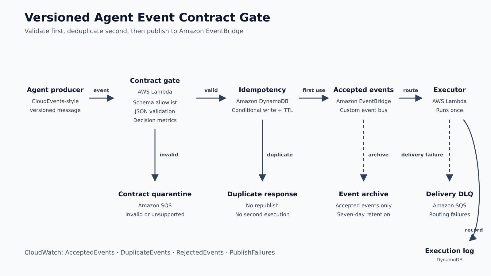

# Prevent Silent Failures Between AI Agents with Versioned Event Contracts on AWS

*Use a CloudEvents-style envelope, JSON Schema, Amazon EventBridge, DynamoDB, and
SQS to reject incompatible messages before they reach an executor.*

Multi-agent systems often fail at the boundaries between agents rather than inside
the model call itself. A planner may rename a field, change an enum, omit a
correlation identifier, or retry a message after a timeout. The receiving agent may
still accept the JSON, but interpret it incorrectly or execute the task twice.

Loose coupling does not mean contract-free communication. An event-driven agent
workflow needs an explicit agreement about structure, version, identity, causation,
and retry behavior.

This article builds a small contract gate that sits before Amazon EventBridge. It
does not implement another agent framework. Its single responsibility is to decide
whether an agent event is safe to publish.

> Repository: `https://github.com/kkmurthyt21/agent-event-contract-gate-aws`

## The failure we want to prevent

Assume a planner emits this contract:

```json
{
  "specversion": "1.0",
  "id": "event-1001",
  "source": "urn:sample:planner",
  "type": "com.example.agent.task.created",
  "dataschema": "agent-task/1.0.0",
  "data": {
    "schemaVersion": "1.0.0",
    "correlationId": "conversation-9001",
    "causationId": "request-8001",
    "idempotencyKey": "task-1001-attempt-1",
    "taskId": "task-1001",
    "task": {
      "action": "summarize",
      "input": "Summarize the neutral sample request."
    }
  }
}
```

A later producer release renames `taskId` to `workItemId` and removes
`causationId`. That may be a reasonable version 2 design, but it is not backward
compatible with a version 1 executor. Publishing it to the same routing path can
produce a delayed runtime failure—or worse, a plausible but incorrect execution.

The gate blocks the event before it becomes a downstream problem.

## Architecture



The flow has four boundaries:

1. **Contract boundary:** validate the complete event against an explicitly
   supported schema.
2. **Idempotency boundary:** reserve an idempotency key with a conditional DynamoDB
   write.
3. **Routing boundary:** publish only accepted events to a custom EventBridge bus.
4. **Failure boundary:** keep invalid contracts separate from delivery failures.

AWS supports structured CloudEvents in the EventBridge `detail` field, which makes
the CloudEvents envelope a useful starting point. The sample adds agent-specific
correlation, causation, idempotency, and schema-version fields.

## Validate before publishing

The gate reads `data.schemaVersion` and maps it to a known schema:

```python
SCHEMA_FILES = {
    "1.0.0": "agent-task-1.0.0.json",
    "1.1.0": "agent-task-1.1.0.json",
}
```

This allowlist is important. The code never constructs a filesystem path directly
from the incoming version. Unknown versions are rejected, even if a schema with a
similar name exists elsewhere.

The sample validator implements only the JSON Schema keywords used by the demo. It
keeps the Lambda package dependency-free and makes the validation behavior easy to
inspect. A production platform accepting arbitrary schemas should use a complete,
standards-compliant JSON Schema implementation.

When validation fails, the gate writes the original event, the validation errors,
and the reason `CONTRACT_INVALID` to an encrypted SQS quarantine queue. It does not
publish the event to EventBridge.

## Make retries safe with a conditional write

Agent workflows retry. Networks time out, callers lose responses, and orchestration
steps can be repeated. A unique event identifier helps with tracing, but it does not
define whether two attempts represent the same intended side effect.

That is why the contract includes a separate `idempotencyKey`.

Before publishing, the gate reserves the key in DynamoDB:

```python
dynamodb.put_item(
    TableName=dedupe_table,
    Item=item,
    ConditionExpression="attribute_not_exists(idempotencyKey)",
)
```

DynamoDB evaluates this condition atomically. The first request succeeds. A retry
using the same key receives `ConditionalCheckFailedException`, and the gate returns
`DUPLICATE` without publishing a second event. A time-to-live attribute removes old
keys after seven days.

If the subsequent EventBridge call fails, the sample removes the reserved key so a
safe retry remains possible.

## Separate invalid input from failed delivery

The architecture uses two SQS queues for different operational owners:

| Queue | Meaning | Likely owner |
| --- | --- | --- |
| Contract quarantine | Producer sent an invalid or unsupported message | Producer or contract owner |
| EventBridge delivery DLQ | Valid event could not reach the executor | Platform or consumer owner |

This separation prevents a contract-breaking release from being mixed with a
temporary delivery problem. It also makes metrics actionable. The gate publishes
`AcceptedEvents`, `DuplicateEvents`, `RejectedEvents`, and `PublishFailures` to a
dedicated CloudWatch namespace.

## Detect breaking changes before deployment

Runtime quarantine is the last line of defense. The earlier control belongs in the
pull request.

The repository includes three schema versions:

- **1.0.0:** baseline contract
- **1.1.0:** adds optional `priority`; compatible
- **2.0.0:** removes `causationId` and renames `taskId`; breaking

The compatibility checker recursively compares object properties, required fields,
types, constants, and enum values. CI accepts 1.1.0 and intentionally fails for
2.0.0.

```powershell
py -3.12 scripts/check_compatibility.py `
  schemas/agent-task-1.0.0.json `
  schemas/agent-task-1.1.0.json
```

Expected result:

```text
COMPATIBLE
```

Running the same command against 2.0.0 reports the removed and newly required
fields, then exits with status 1. This focused checker is an educational example,
not a substitute for a complete schema-evolution policy. Real systems must define
compatibility from both producer and consumer perspectives.

## Deploy the sample

The repository uses AWS SAM and Python 3.12. It creates two Lambda functions, two
DynamoDB tables, a custom EventBridge bus and archive, an EventBridge rule, two SQS
queues, and short-retention CloudWatch log groups.

After configuring temporary AWS CLI credentials, deploy from PowerShell:

```powershell
.\scripts\deploy.ps1
```

Review and approve the CloudFormation change set. Then run:

```powershell
.\scripts\run-demo.ps1
```

The script sends three inputs:

1. A valid version 1 event
2. The same version 1 event again
3. An unsupported version 2 event

## Results

I deployed the sample in `us-east-1` and ran the three-event demonstration.

| Test | Expected | Observed |
| --- | --- | --- |
| Valid 1.0.0 event | `ACCEPTED` | `ACCEPTED` |
| Same idempotency key | `DUPLICATE` | `DUPLICATE` |
| Unsupported 2.0.0 event | `REJECTED` | `REJECTED` |
| Executor execution count | `1` | `1` |
| Quarantine queue | At least one message | `1` |
| Delivery DLQ | Zero messages | `0` |

The Lambda `REPORT` lines showed the following end-to-end durations:

| Invocation | Duration | Billed duration |
| --- | ---: | ---: |
| First valid event | 3,563.92 ms | 3,676 ms |
| Duplicate event | 359.82 ms | 360 ms |
| Rejected event | 330.58 ms | 331 ms |

The first valid event was the initial invocation and included a 111.33 ms cold
start. These are observations from one demonstration, not a performance benchmark
or a measurement of schema validation alone. Confirm that the `AgentContractGate`
metrics appear in CloudWatch. Do not publish account IDs, function ARNs, queue URLs,
request IDs, or customer data in screenshots.

## Design tradeoffs

### Why put the gate before EventBridge?

EventBridge is deliberately flexible about the JSON inside `detail`. That is useful
for routing, but the bus should not become the first place a breaking agent contract
is discovered. The gate gives the producer a synchronous decision and protects all
consumers behind the bus.

### Why keep `id` and `idempotencyKey`?

They answer different questions. `id` identifies this event for tracing.
`idempotencyKey` identifies the intended side effect across retries.

### Why keep an archive?

An EventBridge archive provides controlled replay for events that passed the
contract boundary. Invalid events remain quarantined and are not eligible for normal
replay.

### What is not included?

The sample does not call a foundation model. The reliability problem exists
regardless of whether the agents use Amazon Bedrock, deterministic services, or a
combination. Keeping the example model-independent makes the contract behavior
reproducible.

## Clean up

Delete the stack after the demonstration:

```powershell
.\scripts\cleanup.ps1
```

Budgets are alerts, not hard spending limits. Confirm that the CloudFormation stack
is deleted and review the Billing console for remaining resources.

## Closing thought

Agent autonomy increases the need for explicit boundaries. A versioned contract,
conditional idempotency write, quarantine path, and compatibility check do not make
an agent correct. They make failures visible, attributable, and less likely to
propagate silently.

## References

- [Sending and receiving CloudEvents with Amazon EventBridge](https://aws.amazon.com/blogs/compute/sending-and-receiving-cloudevents-with-amazon-eventbridge/)
- [DynamoDB condition expressions](https://docs.aws.amazon.com/amazondynamodb/latest/developerguide/Expressions.ConditionExpressions.html)
- [EventBridge archives and replay](https://docs.aws.amazon.com/eventbridge/latest/userguide/eb-archive-event.html)
- [AWS SAM documentation](https://docs.aws.amazon.com/serverless-application-model/latest/developerguide/what-is-sam.html)
