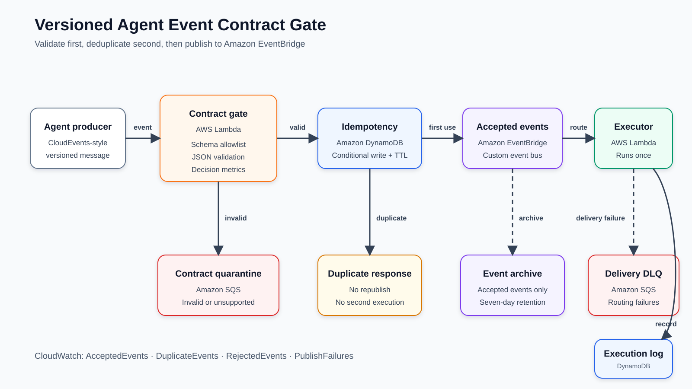

# Agent Event Contract Gate for AWS

This sample prevents malformed, incompatible, and duplicate AI-agent events from
reaching downstream consumers. A Lambda contract gate validates a versioned
CloudEvents-style envelope before publishing it to a custom Amazon EventBridge bus.

## Published article

[Prevent Silent Failures Between AI Agents with Versioned Event Contracts on AWS](https://builder.aws.com/content/3Ivtw3UhZxxl2vzO4z293iDjLlL/prevent-silent-failures-between-ai-agents-with-versioned-event-contracts-on-aws)

## What the sample proves

## What the sample proves

| Scenario | Expected outcome |
| --- | --- |
| Valid 1.0.0 event | `ACCEPTED`; executor records one execution |
| Same event submitted again | `DUPLICATE`; executor is not invoked again |
| Compatible 1.1.0 event | Contract check passes |
| Breaking 2.0.0 schema | Pull-request compatibility check fails |
| Unsupported 2.0.0 event | `REJECTED`; message enters the quarantine queue |
| EventBridge delivery failure | Event enters the delivery dead-letter queue |

A redacted summary of the completed AWS deployment test is available in
[`docs/cloud-test-results.txt`](docs/cloud-test-results.txt). It records one
demonstration and is not presented as a performance benchmark.



## Architecture

1. A producer invokes the contract-gate Lambda function with an agent event.
2. The gate chooses an explicitly supported schema and validates the envelope.
3. Invalid events go to an encrypted SQS quarantine queue.
4. DynamoDB conditionally reserves the idempotency key.
5. A duplicate returns `DUPLICATE` without publishing another event.
6. An accepted event goes to a custom EventBridge bus and seven-day archive.
7. An EventBridge rule invokes the sample executor.
8. The executor writes an execution record to DynamoDB.
9. EventBridge delivery failures go to a separate SQS dead-letter queue.

## Why there are two queues

The quarantine queue and delivery dead-letter queue represent different failures:

- **Quarantine:** the producer sent an invalid or unsupported contract.
- **Delivery DLQ:** the contract was valid, but EventBridge could not deliver it.

Combining them makes diagnosis and ownership unclear.

## Prerequisites

- Windows 11 or another supported operating system
- AWS CLI 2.32.0 or newer
- AWS SAM CLI
- Python 3.12
- An AWS account with a cost budget and a non-root development identity

Verify the tools in PowerShell:

```powershell
aws --version
sam --version
py -3.12 --version
```

## Authenticate without access keys

This repository assumes two local profiles:

- `community-builder-dev`: the browser-login profile
- `community-builder-sam`: a process-credentials profile for tools that do not
  directly understand AWS CLI login sessions

Log in:

```powershell
aws login --profile community-builder-dev
```

Create the compatible profile once:

```powershell
aws configure set credential_process "aws configure export-credentials --profile community-builder-dev --format process" --profile community-builder-sam
aws configure set region us-east-1 --profile community-builder-sam
aws configure set output json --profile community-builder-sam
```

Verify it:

```powershell
aws sts get-caller-identity --profile community-builder-sam
```

The ARN must identify your non-root development user.

## Run local checks

```powershell
py -3.12 -m unittest discover -s tests -v
py -3.12 scripts/check_compatibility.py schemas/agent-task-1.0.0.json schemas/agent-task-1.1.0.json
py -3.12 scripts/check_compatibility.py schemas/agent-task-1.0.0.json schemas/agent-task-2.0.0.json
```

The first compatibility command prints `COMPATIBLE`. The second intentionally
prints `BREAKING` and exits with status 1.

## Deploy

From the repository root:

```powershell
.\scripts\deploy.ps1
```

Review the CloudFormation change set when SAM asks for confirmation. All resources
are serverless or on-demand. Charges can still occur, so use a test account and keep
the budget alert enabled.

## Run the cloud demonstration

```powershell
.\scripts\run-demo.ps1
```

The script invokes the gate three times and then checks the execution table,
quarantine queue, and delivery DLQ. Save the terminal output for the article only
after verifying that it contains no account identifiers.

## Inspect metrics

In the CloudWatch console, open **Metrics → All metrics → AgentContractGate**. The
sample emits these count metrics:

- `AcceptedEvents`
- `DuplicateEvents`
- `RejectedEvents`
- `PublishFailures`

## Clean up

Delete the stack after testing:

```powershell
.\scripts\cleanup.ps1
```

Confirm in CloudFormation that the stack is gone. Also review **Billing → Bills**
for unexpected resources or charges.

## Contract-evolution policy

Version 1.1.0 adds the optional `priority` property and is backward compatible for
the contract used here. Version 2.0.0 intentionally renames `taskId` to
`workItemId` and removes `causationId`. CI blocks that change.

The runtime validator implements only the JSON Schema keywords used in this sample.
For arbitrary schemas, use a complete, standards-compliant JSON Schema library.

## Security notes

- Do not create root-user or IAM-user access keys for this sample.
- Use MFA and temporary browser-based CLI credentials.
- Do not put secrets, customer data, or employer data in sample events.
- Narrow or remove temporary administrative permissions after deployment.
- The queues use SQS-managed server-side encryption.
- Logs and archived events are retained for seven days.

## License

Apache License 2.0. See [LICENSE](LICENSE).
